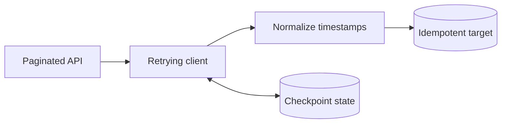

# Resilient API Ingestion

A production-inspired Python reference pipeline for paginated operational APIs. It demonstrates the patterns that make recurring ingestion dependable: bounded retries, rate-limit handling, checkpoint/resume, timezone normalization and idempotent upserts.

> This is an original portfolio project built with synthetic examples. It contains no employer code, credentials, customer data or proprietary schemas.

## Why this project exists

API ingestion usually fails at the edges: a page token expires, a provider returns `503`, a job restarts midway, or the same record arrives twice. This project treats those conditions as normal operating states instead of exceptional surprises.



## Engineering features

- Token-based pagination with resumable checkpoints
- Retry handling for `429`, `5xx`, timeouts and connection failures
- `Retry-After` support with bounded exponential backoff
- Atomic page loads and checkpoint updates
- UTC normalization for timezone-aware source timestamps
- Primary-key upserts for safe reruns
- Dependency injection for deterministic tests
- GitHub Actions CI with Ruff and Pytest

## Run locally

```bash
python -m venv .venv
source .venv/bin/activate
python -m pip install -e ".[dev]"
cp .env.example .env
```

Export the variables from `.env`, then run a window:

```bash
ingest-api \
  --start 2026-01-01T00:00:00Z \
  --end 2026-01-02T00:00:00Z
```

Run the quality checks:

```bash
ruff check .
pytest -q
```

## Production adaptation

The included SQLite store keeps the example runnable without cloud infrastructure. In production, the same interface can be backed by PostgreSQL or Azure SQL, with secrets sourced from Key Vault and orchestration handled by Azure Data Factory, Databricks Workflows or Azure Functions.

## Design decisions

| Concern | Implementation |
|---|---|
| Partial failure | Checkpoint saved after every committed page |
| Duplicate delivery | Upsert by stable source event ID |
| Timezones | Reject naive timestamps; persist UTC |
| Throttling | Honor `Retry-After`, then exponential backoff |
| Auditability | Preserve normalized columns and complete source payload |

## Author

[Dhananjay Panchal](https://dhananjay-panchal.github.io/) — Azure Data Engineer

